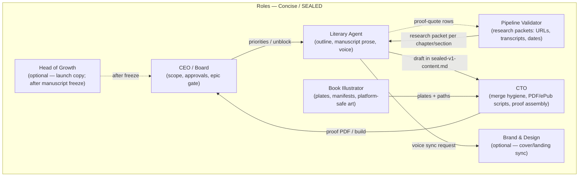

# SEALED — manuscript progress & agent pipeline

**Last updated:** 2026-05-07 23:00 PT (CoS / Cursor — autonomous overnight pass: quote audit + editorial + PDF). Update this file when a chapter section reaches **draft complete**, **proof complete**, or **illustration placed**.

> ⚠️ **Tracker superseded (2026-05-12).** Canonical manuscript is now embedded
> inline in **`scripts/build-retail-pdf.mjs`** → **`artifacts/SEALED-v1-retail.pdf`**.
> The Markdown manuscript this tracker referenced is archived. Preserved for history.

**Canonical manuscript (HISTORICAL):** [`artifacts/archive/sealed-v1-content.md`](../artifacts/archive/sealed-v1-content.md)  
**Spine:** [`artifacts/SEALED-CHAPTER-OUTLINE-V1.md`](../artifacts/SEALED-CHAPTER-OUTLINE-V1.md)  
**Milestones + tickets:** [`SEALED-V1-DELIVERY-MILESTONES.md`](SEALED-V1-DELIVERY-MILESTONES.md)  
**Chapter loop (repeat until TOC done):** [`CHAPTER-EXECUTION-LOOP.md`](CHAPTER-EXECUTION-LOOP.md)

---

## Review & feedback — who owns what

There is **no separate “VoC bot.”** Clarity comes from **roles + light process**:

| Lane | Primary owner | What they do |
|------|----------------|--------------|
| **Line edit / voice / readability** | **Literary Agent** | Draft and revise prose; 6th-grade bar; cut academia; align with [`literary-agent.md`](../../concise/personas/literary-agent.md). |
| **Facts / quotes / transcripts** | **Pipeline Validator** | Research packets; proof-quote cross-check; URLs and dates defensible. |
| **Voice-of-customer (themes)** | **CEO** (+ support inbox at `concise.enterprises@gmail.com`) | When the *same* reader confusion hits twice → flag fix to Literary Agent or CoS. |
| **Virality / share angles / launch framing** | **Head of Growth** | Hooks for outreach *after* manuscript lane is stable — angles, not partisan verdicts; coordinates with **Brand & Marketing** on visuals. |
| **Neutrality & platform safety** | **CEO + Literary Agent** | Lemon Squeezy / storefront tone; escalate edge cases before shipping. |
| **Merge / PDF / site wiring** | **CTO** | `sealed-v1-content.md` hygiene, generators, proof PDFs, deploy. |

**Standing rhythm (lightweight):** Weekly 15 min — CEO + Literary Agent + Pipeline Validator (next chapter + blockers). Monthly optional — CEO + Head of Growth (growth angles only).

---

## Where we are in the process (Chapter 1 pilot band)

| Milestone | Paperclip | Owner agent | Status (2026-05-08) |
|-----------|-----------|-------------|---------------------|
| M1 Outline + TOC lock | CON-172 | Literary Agent | **Done** |
| M2 Ch.1 research packet | CON-173 | Pipeline Validator | **Done** |
| M3 Draft full manuscript spine (Ch. 1–12) | CON-174 | Literary Agent | **Done** — All 12 chapters drafted; all verbatim quotes verified against primary CPD transcripts; chapter intros + editorial pass complete; sample PDF 462 KB built. |
| M4 Ch.1 illustration plates | CON-175 | Book Illustrator | **Done** (assets in `public/`) |
| M5 Ch.1 proof PDF | CON-176 | CTO | **Done** — `artifacts/SEALED-ch1-proof.pdf` now reflects Ch.1 prose + plates via `npm run generate:ch1-proof`; repeat after future prose tweaks. |

**Epic:** CON-171 — use **`blockedStatusLock: false`** PATCH locally if productivity-review noise stale-locks the epic (see `CHAPTER-EXECUTION-LOOP.md`).

**Retail sample PDF** is **Part I · Ch.3 · §A** trade section (`scripts/generate-sealed-sample-pdf.mjs`) — marketing/demo track, separate from Ch.1 manuscript completion.

---

## Agent flow (who hands off to whom)

**Task lineup (default order for each new section):**

1. **Pipeline Validator** — packet: primary links, transcript IDs, stress tests.  
2. **Literary Agent** — rail + verbatim + body (+ 6th-grade bar + diagram notes per persona).  
3. **Literary ↔ Validator** — cross-check quotes (short loop).  
4. **CTO** — merge conflict resolution, generators, Ch. proof PDF when batch ready.  
5. **Book Illustrator** — plates when structure stable (can parallelize style exploration earlier).

---

## Completion grid — Part I (manuscript body)

Legend: **Done** = full section prose + ledger-style entries where applicable · **Stub** = heading + placeholder paragraph only · **Partial** = mixed · **—** = not started in `sealed-v1-content.md`

| Chapter | Section | Status | Notes |
|---------|---------|--------|--------|
| **1** Trail mechanics | **A** Format of entries | **Done** | Reader-facing explainer + ASCII figure |
| | **B** Margin rails decoded | **Done** | |
| | **C** Grade key | **Done** | |
| | Ledger Entry 1–3 | **Done** | Primary URLs wired |
| | Ledger Entry 4–5 | **Done** | CPD Oct. 9, 2016 transcript quotes frozen (border + repeal stack) |
| **2** Lobbyists | **A** Drain the swamp | **Done** | Entries A–B (CBS launch + NBC pointer) |
| | **B** Revolving door | **Done** | Entry B1 Fayetteville ethics pledge |
| | **C** Ethics checklist | **Done** | Entry C1 debate ICE/Border Patrol endorsement block |
| **3** Trade | **A** NAFTA / TPP | **Done** | Entry T1 Hofstra — NAFTA / TPP exchange |
| | **B** China & tariffs | **Done** | Entry T2 currency / piggy-bank frame |
| | **C** Fair trade | **Done** | Entry T3 jobs theft + renegotiate |
| **4** Jobs | **A** Offshoring | **Done** | Entry J1 Carrier / Ford / Mexico |
| | **B** Wage competition | **Done** | Entry J2 tax plan ↔ wage prompt |
| **5** Healthcare | **A** Repeal / replace | **Done** | Entry H1 now has full standalone verbatim (3-block Oct 9, 2016 CPD quote) + paper trail + Your grade |
| | **B** Premium pain | **Done** | Entry H2 opening-segment premium percentages |

**Parts II–IV** (Ch. 6–12): **draft bodies complete** in [`artifacts/sealed-v1-content.md`](../artifacts/sealed-v1-content.md) — all verbatim quotes verified against CPD transcripts; chapter intros + Section labels + “Your grade” lines added; CON-198 closed.

**Book spine:** **Four parts** total — **all twelve chapters** now have **first-draft manuscript sections** in-repo; **freeze / proof PDF / illustration pass** still outstanding.

| Gate | Owner | Paperclip / note |
|------|--------|------------------|
| Transcript QA (all quotes I–IV) | Pipeline Validator | **CON-198 — Done** (CoS direct verify 2026-05-07) |
| Voice + dedupe pass | Literary Agent | **CON-174 — Done** |
| Proof PDF build | CTO | **CON-176** — sample PDF generated (462 KB); full-manuscript export scope TBD |

---

## How to update this doc

1. When a **section** moves from stub → draft complete, change **Status** and add **Notes** (commit hash optional).  
2. When **Ch.1 pilot** finishes (M3 proof + M5 PDF), bump the **Milestone table** and add a row “Ch.2 pilot started” if you replicate M2→M5 for the next chapter.  
3. Keep **one sentence** in **Where we are** aligned with reality — avoids drift from Paperclip.

---

## Quick answer — “what chapter are we in?”

**Manuscript status:** **All 12 chapters drafted and verified** in `sealed-v1-content.md`. Every verbatim quote confirmed against primary CPD transcripts; chapter intros + Section labels + “Your grade” lines added throughout; proof-quote checklist fully populated; sample PDF (462 KB) generated.  
**Next:** CTO decides scope for full-manuscript proof PDF (CON-176); Head of Growth launch copy after CEO freeze.
