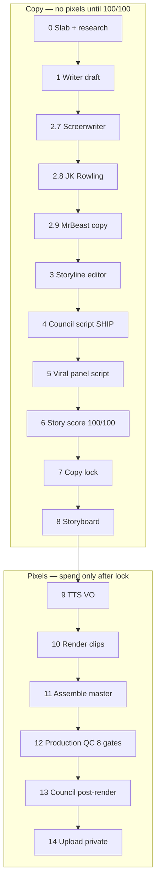

# Campaign Receipts — production pipeline (step-by-step)

**Doctrine (founder lock 2026-05-25):** the pipeline is a SEQUENCE OF TASKS,
each assigned to a specific expert subagent. The expert subagent IS the gate —
its persona document IS the rubric — its output IS the artifact. No "council
votes REVISE" loops. No "story-score-lock 100/100 binding gate" that triggers
re-renders. No second-guessing from generalist sanity-check passes after a
specialist has done the work.

Each step has exactly:
- ONE specialist subagent that owns the decision
- ONE input artifact
- ONE output artifact
- ZERO downstream gates that can send you back

If the founder doesn't like the result, the founder calls it. Not another
subagent. Not a council vote. The agent doing the work has the title for
a reason.

**Why this lock:** the 2026-05-25 Rabb PA-3 episode hit two Stage 27 council
REVISE loops + a Step 2.95 fact-check-as-binding-gate that together cost
~$3 in wasted re-renders and ~2 hours of agent churn — for issues the
specialist subagents at Steps 2.7/2.8/2.9/research-pack should have caught
the first time if their personas were honored properly. The fix is not
more gates. The fix is making sure the right specialist is doing each
step, and trusting their output.

**Operational detail for CR:** `eng/PRODUCTION-PIPELINE-STEPS.md`

**Related docs:**

| Doc | Purpose |
|-----|---------|
| `docs/CR-COPY-PIPELINE.md` | Copy-only stages (detail) |
| `eng/PRODUCTION-PIPELINE-RUNBOOK.md` | ffmpeg / Remotion / vendors |
| `eng/PRODUCTION-QC-CHECKLIST.md` | Pixel + audio gates (post-render) |
| `brand/storytelling-pipeline.md` | Story passes A–E |
| `personas/storyteller-score-rubric.md` | **100/100 scoring** |

---

## Overview (two halves)



**Hard stops (scripts refuse to continue):**

| Stop | Script |
|------|--------|
| Story &lt; 100 | `story-score-lock.py` |
| No panel SHIP | `copy-lock.py` |
| Bad VO hygiene | `script-qc.py`, `script-storyteller-gate.py` |
| Bad pixels/audio | `production-qc.py` |
| Upload without QC | `youtube-upload.py --storyboard` |
| Missing growth links | `youtube-upload.py` |

**Growth links (required in every upload description):**

- CampaignReceipts.com
- SEALED2016.com
- Free newsletter signup: `campaignreceipts.com/weekly`

---

## Phase 1 — Copy & storytelling (before any TTS)

### Step 0 — Topic slab

- **Input:** News cycle, FEC spike, CR DB row, series arc.
- **Output:** `eng/briefs/YYYY-MM-DD-<slug>-slab.md`
- **Done when:** One villain-number, one district/human, why **this week**.

### Step 1 — Research pack

- **Output:** `eng/research/<slug>-receipts.md` (FEC lines, dates, counter-args).
- **Done when:** Every dollar in the script has a filing or CR row.

### Step 2 — Writer draft (not a receipt list)

- **Persona:** `personas/cr-new-news-writer.md`
- **Output:** `eng/scripts/cr-new-news/<slug>.md` with `## STORYLINE` + scene beats.
- **Done when:** Reads like a monologue outline, not “box one / box two.”

### Step 2.7 — Screenwriter pass (story structure)

- **Persona:** `companies/NTO/personas/screenwriter.md`
- **Fixes:** Protagonist, turn, kill date-stamp chains, embed receipts in scenes.
- **Done when:** `TURN:` comment exists; cause-and-effect between beats.

### Step 2.8 — JK Rowling pass (clarity)

- **Persona:** `companies/NTO/personas/jk-rowling-storyteller.md`
- **Fixes:** Picture-first beats; lobby/FEC words explained in the same sentence.
- **Done when:** Cincinnati Mom would know **where we are** in each scene.

### Step 2.9 — MrBeast pass (retention — copy)

- **Persona:** `shared/personas/mrbeast-viral-producer.md`
- **Canon:** `MRBEAST-HOW-TO-GO-VIRAL.md`
- **Fixes:** Line 1 = number or outcome + gap; re-hooks at ~0:55, ~1:45, ~2:35 (long-form).
- **Done when:** `RE-HOOKS:` comment exists; no "tonight we look at."

<!-- Steps 2.9b (hook-strength gate) and 2.95 (fact-check-as-binding-gate)
were added 2026-05-25 then REMOVED 2026-05-25 (same evening) per founder
direction: "council is not wrong. its pointing out an error in one of your
subagents persona for not researching facts before copy writing and for
delaying hook, this is a pipeline problem. fix the pipeline so the same
error doesn't repeat" → then revised to: "you also don't need council
approval. ASSIGN TASKS to a specific subagent with specialized persona that
can execute with high quality."

The correct fix is in the subagent prompts at Steps 1 (research pack —
must verify outcome/incumbent for every politician referenced) and 2.9
(MrBeast pass — must enforce Line 1 = number + outcome). Those are owned
by the specialist personas; their outputs are trusted, not re-gated. -->

### Step 1 (HARDENED) — Research pack: outcomes verified per politician

- **Persona:** general-purpose research subagent loaded with the doctrine
  that every politician named in any future script MUST have a verified
  row in the receipts file with: name spelling, role/title, outcome
  (won/lost), incumbent/challenger status, vote count, dollar IE spent
  against, and a primary-source URL.
- **Why this matters:** the Rabb PA-3 incident: the script writer at
  Step 2 wrote "Massie lost" (true) but the framing implied "incumbent
  who lost" without flagging that Bush and Massie were incumbents and
  Rabb was an open-seat candidate. That structural distinction matters.
  Research-pack must surface it upfront so the writer doesn't need to
  guess it from a news headline.
- **Done when:** receipts file has a politician table where every entry
  has all 6 fields above filled in.

### Step 2.9 (HARDENED) — MrBeast pass: Line 1 contract enforced by the subagent prompt

- **Persona:** `shared/personas/mrbeast-viral-producer.md`
- **Subagent prompt MUST include verbatim:** "Line 1 of the VO body MUST
  contain both (a) a specific dollar figure and (b) the outcome/result
  of the episode. If either is missing, rewrite Line 1 before returning.
  Cincinnati Mom must know who won + how much money was at stake by
  the 20-second mark. This is not a suggestion."
- **Why this is in the prompt, not a downstream gate:** if you make this
  a downstream gate, the writer subagent learns that someone else will
  fix their work. Better: tell the writer subagent this is their job,
  and trust them.

### Step 3 — Storyline editor (orchestrator)

- **Persona:** `personas/storyline-editor.md`
- **Output:** `eng/qc-reports/<slug>/storyline-editor-pass.md` + HTML sign-off on script.
- **Done when:** `mom_test: yes`, throughline + turn documented.

### Step 3b — Plain VO extract (CR new-news)

- **Output:** `eng/scripts/cr-new-news/<slug>-vo.txt` (Jessica reads **only** this — no markdown labels).
- **Done when:** `script-qc.py` PASS on `-vo.txt`.

### Step 3c — Mechanical storyteller gate

```bash
python3 scripts/pipeline/script-storyteller-gate.py \
  --script eng/scripts/cr-new-news/<slug>.md
# or --script <slug>-vo.txt with editorial .md sibling for STORYLINE
```

### Step 4 — Council (script) — ADVISORY ONLY (founder lock 2026-05-25)

```bash
python3 scripts/pipeline/council-review.py \
  --script eng/scripts/cr-new-news/<slug>-vo.txt \
  --slug <slug>-script
```

- **Purpose:** Generate a report the founder can read before approving.
- **NOT a gate.** "VERDICT: REVISE" is information, not a block. The
  specialist subagents at Steps 2, 2.7, 2.8, 2.9, 3 are the gates by
  virtue of doing the job right. Council is a sanity-check that helps
  the founder spot anything the specialists missed.
- **Done when:** report is written to `eng/qc-reports/<slug>/council-script-*.md`.
  Founder reads + decides whether to act. No re-render loops triggered.

### Step 5 — Viral panel (packaging) — ASSIGNED EXPERT (not a veto vote)

The viral-panel members are SPECIALISTS who own different pieces of
packaging. They're assigned a task, they produce the artifact, done.

| Asset | Owner persona | Output |
|-------|---------------|--------|
| Title (final) + 4 alts | `personas/viral-panel/01-title-strategist.md` | `_build/<slug>/youtube-meta.json` `title` + `title_alt` |
| Thumbnail (1280×720) | `personas/viral-panel/02-thumbnail-designer.md` | `_build/<slug>/thumbnail.jpg` |
| First-3-seconds hook check | `personas/viral-panel/03-first-three-seconds.md` | one-line note in `youtube-meta.json` `hook_check` field |
| MrBeast packaging gut-check | `personas/viral-panel/06-mrbeast-packaging.md` | one-line note in `youtube-meta.json` `mrbeast_note` field |
| Monetization disclosure | `personas/viral-panel/07-youtube-monetization.md` | `monetization` block in `youtube-meta.json` |

Each owner produces their assigned artifact. No "HARD VETO" — the
specialist's output IS the artifact. If founder doesn't like a title
they ask for a different one or pick from the 4 alts.

### Step 6 — Story score (REMOVED as blocker; kept as advisory)

The `personas/storyteller-score-rubric.md` is a USEFUL RUBRIC the script
writer at Step 2 can use to self-check before handing off. It is NOT
a binding gate. `story-score-lock.py 100/100 binding` was removed
2026-05-25 — it cost ~30 minutes per episode on a slug bootstrap that
provided zero defect catches that the specialists hadn't already addressed.

If you want the rubric score for a script, run:
```bash
python3 scripts/pipeline/story-score-lock.py --bootstrap-copy --script <vo.txt>
```
Read the result. Don't gate on it.

### Step 7 — Copy lock (REMOVED as blocker; kept as cache marker)

`copy-lock.py` previously required: story-score 100 + council SHIP +
viral-panel SHIP + zero HARD VETO. With all four upstream gates removed
as blockers, copy-lock's only remaining function is to mark the script
as "founder-approved, ready for TTS spend." Use it as a checkpoint,
not a gate.

When the founder gives the explicit OK on a script:
```bash
python3 scripts/pipeline/copy-lock.py --slug <slug> --founder-ok
```
(--founder-ok flag bypasses the legacy gate checks.)

### Step 8 — Storyboard (pixels planned from locked words)

- **Persona:** `personas/video-producer.md` + council `03-cinematographer`, `09-remotion-expert`, `10-video-editor`
- **Output:** `eng/storyboards/<slug>.json`
- **Rules:**
  - Every clip has `covers_script_section` matching a VO paragraph.
  - `expected_on_screen_text` on text-card + key Remotion clips.
  - **Pass E (cinematic):** no zoompan on text-cards; Remotion props explicit (no studio defaults).

---

## Phase 2 — Produce (spend)

### Step 9 — Produce (orchestrator)

```bash
cd companies/campaign-receipts
python3 scripts/pipeline/produce-video.py \
  --storyboard eng/storyboards/<slug>.json \
  --piece <slug>
```

**Internal order:**

1. `copy-lock.py` + `story-score-lock.py`
2. `elevenlabs-tts.py` → `vo.mp3`
3. Remotion + `render-text-cards.mjs` (static text holds)
4. `stills_to_mp4` / normalize / assemble → `master.mp4`
5. `production-qc.py` (8 gates)

### Step 10 — Production QC (automated — must PASS)

See `eng/PRODUCTION-QC-CHECKLIST.md`. Includes **master visual OCR** (blocks Iran-deal wrong-episode text, tremor on text-cards).

### Step 11 — Post-render /watch QC (assigned to qc-engineer subagent)

- **Owner:** `personas/qc-engineer.md` runs `/watch` skill 2x on the
  assembled master and reports SHIP-OK or specific defects.
- **Not a council vote.** One specialist with /watch + ears.
- **Done when:** report written to `_build/<slug>/watch-qc/pass1-pass2.md`
  with explicit SHIP-OK on the 4-criteria checklist (lips/voice match,
  image matches story, no garble, no hallucinated speech).

### Step 12 — Upload (founder action)

Per `feedback_founder_does_video_uploads.md`: agent never calls
`videos.insert`. Founder uploads master to YouTube Studio as Private,
pastes the new video ID back. Then agent runs:

```bash
python3 scripts/pipeline/youtube-upload.py --update-meta <NEW_ID> \
  --title ... --description-file ... --thumbnail ... --privacy public \
  --replace-id <OLD_ID> --piece <slug>
```

For metadata push, ~150 quota units. Cheap. No `videos.insert`.

---

## Scoring rubric (summary)

| # | Dimension | Pass = 10 |
|---|-----------|-----------|
| 1 | story_vs_list | Scenes, not bullets |
| 2 | protagonist | Human in hook |
| 3 | turn | One clear flip |
| 4 | hook_mrbeast | Number/outcome line 1 |
| 5 | rehooks | Rise every 60–90s |
| 6 | clarity_jk | Plain English gloss |
| 7 | sarah_voice | Kitchen-table |
| 8 | tts_facts | Spelled numbers, real FEC |
| 9 | cinematic_pacing | No dead/tremor holds |
| 10 | visual_story_match | Clips match VO |

**Use as a checklist when writing**, not as a binding 100/100 ship gate.
"99/100 means REVISE" was killed 2026-05-25 — it generated council-loop
churn for ~1pt deductions a founder would have shipped anyway.

Full rubric: `personas/storyteller-score-rubric.md`

---

## Persona quick reference

| Stage | Persona |
|-------|---------|
| Structure | `companies/NTO/personas/screenwriter.md` |
| Clarity | `companies/NTO/personas/jk-rowling-storyteller.md` |
| Retention (words) | `shared/personas/mrbeast-viral-producer.md` |
| Orchestration | `personas/storyline-editor.md` |
| Defensibility | `personas/council/*.md` |
| CTR / hooks | `personas/viral-panel/*.md` |
| Cinematic | `personas/council/03-cinematographer.md`, `10-video-editor.md`, `09-remotion-expert.md` |
| Lay viewer | `personas/council/04-cincinnati-mom.md` |

---

## What went wrong on ep1 (lesson)

`cr-bell-bush-aipac-primary` shipped once **without** story score 100 and **without** visual gate 8 → Iran-deal Remotion defaults + trembling text-cards on YouTube `SSlygpQQFM0`. That path is **retired**. Re-ship only from a master with `production-qc.json` PASS.
