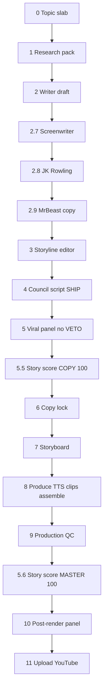

# Production pipeline — step by step (binding)

**Portfolio canon (contract):** [`shared/portfolio-hub/youtube-production-pipeline.md`](../../../shared/portfolio-hub/youtube-production-pipeline.md) — read end-to-end. The **Per-step QC matrix** section is law; the rest is rationale.

**Per-step scorer:** `shared/scripts/step_qc.py` — run after **every** persona pass. **Exit 2 = redo that pass; do not continue.**

**Rule:** No TTS until **copy 100/100** + step-qc PASS on 2.7–2.9. No upload until **master 100/100** + production QC + G9 watch loop.

**Rubric:** `personas/storyteller-score-rubric.md`  
**Score file:** `eng/story-scores/<slug>.json`  
**Gates:** `verify-step-qc.py`, `story-score-lock.py`, `copy-lock.py`, `production-qc.py`

---

## Flow (two score checkpoints)



---

## Phase A — Copy (before any pixels)

| Step | Who / tool | Input | Output | Hard stop |
|------|------------|-------|--------|-----------|
| **0** | Series architect | News / book chapter | `eng/briefs/<date>-<slug>-slab.md` | No script without “why now” |
| **1** | Research | FEC + book + CR DB | `eng/research/<slug>-receipts.md` | No invented figures |
| **2** | `cr-new-news-writer.md` or longform/short script | Research | `eng/scripts/.../<slug>.md` or `eng/longform-scripts/`, `eng/shorts-scripts/` | Receipt dump |
| **2.7** | NT `screenwriter.md` | Draft → screenwriter out | Turn + protagonist | **`step_qc --step screenwriter` PASS** (exit 2 → redo 2.7) |
| **2.8** | NT `jk-rowling-storyteller.md` | After 2.7 | Picture-first beats | **`step_qc --step jk-rowling` PASS** |
| **2.9** | `mrbeast-viral-producer.md` **MODE: COPY** | After 2.8 | Hook + re-hooks | **`step_qc --step mrbeast-copy` PASS** |
| **3** | `storyline-editor.md` | After 2.9 | `STORYLINE` / `TURN` / `RE-HOOKS` | Mom-test no |
| **4** | `council-review.py` | Script | `eng/qc-reports/<slug>/council-script-*.md` | Not `VERDICT: SHIP` |
| **5** | Viral panel 01–03 | Script | `viral-script-*.md` | Any HARD VETO |
| **5.5a** | `script-storyteller-gate.py` | Script | `qc-storyteller-*.md` PASS | Mechanical story fail |
| **5.5b** | `script-qc.py` | Script | `qc-script-*.md` PASS | Metadata in VO |
| **5.5c** | Agent scores rubric dims **1–8** | Passes A–D | `eng/story-scores/<slug>.json` | Any dim &lt; 10 |
| **5.5d** | `story-score-lock.py --phase copy` | Score JSON | Exit 0 | composite ≠ 100 |
| **6** | `copy-lock.py` | Score + council | `eng/copy-locks/<slug>.json` | Scores &lt; 100 |

**SEALED path** (`eng/longform-scripts/`, `eng/shorts-scripts/`): same passes **5.5a–d**. Use `story_score_slug` in storyboard JSON (usually = script stem). Skip `copy-lock` only with `--skip-copy-lock` (emergency); **story score copy 100 still required**.

### Commands (copy phase)

```bash
cd "/Applications/DrAntoniou Projects/AgentCompanies"
SLUG=<slug>
SCRIPT=companies/campaign-receipts/eng/scripts/cr-new-news/${SLUG}.md
DRAFT=companies/campaign-receipts/eng/scripts/cr-new-news/${SLUG}.draft.md   # step 2 output

# === Per-step QC (halt on exit 2 — redo that pass) ===
python3 shared/scripts/step_qc.py --step screenwriter --prev "$DRAFT" --curr "$SCRIPT" --slug "$SLUG"
python3 shared/scripts/step_qc.py --step jk-rowling     --prev <after-2.7.md> --curr "$SCRIPT" --slug "$SLUG"
python3 shared/scripts/step_qc.py --step mrbeast-copy   --prev <after-2.8.md> --curr "$SCRIPT" --slug "$SLUG"

cd companies/campaign-receipts

# Mechanical + hygiene
python3 scripts/pipeline/script-storyteller-gate.py --script eng/shorts-scripts/<slug>.md --mode short
python3 scripts/pipeline/script-qc.py --script eng/shorts-scripts/<slug>.md

# Verify all step-qc JSONs on disk (copy-lock calls this automatically)
python3 scripts/pipeline/verify-step-qc.py --phase copy --editorial eng/scripts/cr-new-news/<slug>.md --slug <slug>

# After human/panel scoring — bootstrap score file from mechanical PASS (dims 1–8 only)
python3 scripts/pipeline/story-score-lock.py --bootstrap-copy --script eng/shorts-scripts/<slug>.md

# Verify 100/100 copy gate
python3 scripts/pipeline/story-score-lock.py --slug <slug> --phase copy

# CR new-news only — full copy lock
python3 scripts/pipeline/copy-lock.py --slug <slug>
```

---

## Phase B — Storyboard (still copy score 100)

| Step | Who / tool | Output | Hard stop |
|------|------------|--------|-----------|
| **7** | `video-producer.md` + council 09 Remotion | `eng/storyboards/<slug>.json` | **`step_qc --step storyboard-coverage` PASS** |
| **7b** | `mrbeast-viral-producer.md` **MODE: PRODUCTION** | Storyboard notes | **`step_qc --step mrbeast-production` PASS** |
| **7c** | `validate-storyboard.py` | PASS | Hedra, FLUX text |

Score **dim 9–10** on paper at storyboard (cinematic_pacing, visual_story_match). Update `eng/story-scores/<slug>.json` when storyboard is final.

---

## Phase C — Produce

| Step | Tool | Notes |
|------|------|--------|
| **8a** | `produce-from-storyboard.py` or `produce-short-generic.mjs` | Runs `story-score-lock --phase copy` before TTS |
| **8b** | `elevenlabs-tts.py` | Jessica/Sarah; verify scribe |
| **8c** | fal + Remotion + ken-burns | Per `PRODUCTION-ROSTER.md` |
| **8d** | Assemble + music + grade | `master.mp4` |

**Long-form:**

```bash
python3 scripts/pipeline/produce-from-storyboard.py \
  --storyboard eng/storyboards/<slug>.json
```

**Short:**

```bash
node scripts/shorts/produce-short-generic.mjs --episode <episode-config-stem>
```

---

## Phase D — Master QC (100/100 required to upload)

| Step | Tool | Checks |
|------|------|--------|
| **9** | `production-qc.py` | script, storyboard, ship-checklist, scribe, audio, visual OCR |
| **9b** | `ship-checklist.py` | sync, duration, audio stream |
| **9c** | Agent sets dims **9–10** = 10 in score JSON | After spot-watch + visual QC |
| **9d** | `story-score-lock.py --phase master` | All 10 dims = 10, composite = 100 |
| **10** | Council **video QC watch** + `step_qc --step video-qc-summary` | `reports/council/*-video-qc*.md` | **0 BLOCKERs**; exit 2 → fix beats, re-watch |
| **11** | `pre-upload-pack.py` + `youtube-upload.py` | All step_qc + master 100 + `production-qc.json` |

```bash
python3 scripts/pipeline/production-qc.py \
  --storyboard eng/storyboards/<slug>.json \
  --piece <piece-id> \
  --expect-voice jessica

# After dims 9–10 confirmed:
python3 scripts/pipeline/story-score-lock.py --slug <slug> --phase master

python3 scripts/pipeline/youtube-upload.py --storyboard eng/storyboards/<slug>.json --privacy private
```

---

## Scoring rubric (100/100 only)

**Composite:** `100` only when **every** dimension = `10`. No averages. No 9.5 pass.

| # | Key | Dimension | When scored |
|---|-----|-----------|-------------|
| 1 | `story_vs_list` | Story vs list | Copy (screenwriter) |
| 2 | `protagonist` | Human anchor | Copy |
| 3 | `turn` | One “wait—what?” | Copy |
| 4 | `hook_mrbeast` | Cold open | Copy |
| 5 | `rehooks` | Retention / re-hooks | Copy |
| 6 | `clarity_jk` | 6th-grade clarity | Copy |
| 7 | `sarah_voice` | Kitchen-table voice | Copy |
| 8 | `tts_facts` | Speakable + true | Copy |
| 9 | `cinematic_pacing` | Edit rhythm | Master (after assemble) |
| 10 | `visual_story_match` | Pixels match VO | Master |

**Passes (each must record score 10):** A Screenwriter · B JK · C MrBeast · D Storyline editor · E Cinematic (editor + cinematographer + Remotion)

Full table + fail signals: `personas/storyteller-score-rubric.md`

---

## What “PASS” means

| Checkpoint | Command | Pass condition |
|------------|---------|----------------|
| Copy | `story-score-lock.py --phase copy` | Dims 1–8 all 10, `composite_copy` = 100, `verdict` = SHIP |
| Master | `story-score-lock.py --phase master` | Dims 1–10 all 10, `composite` = 100, reports on disk |
| Upload | `production-qc.py` + `youtube-upload.py` | `production-qc.json` pass + master score 100 |

**Emergency skips** (`--skip-copy-lock`, `--skip-production-qc`, `--skip-storyteller`) are debug-only — not shipping.

---

## Related docs

- **`shared/portfolio-hub/youtube-production-pipeline.md`** — portfolio contract + Per-step QC matrix  
- `shared/portfolio-hub/production-qc-8-gates.md` — G1–G8 automated gates  
- `shared/portfolio-hub/council-lanes.md` — parallel reviewer lanes  
- `docs/CR-COPY-PIPELINE.md` — CR new-news copy stages  
- `brand/storytelling-pipeline.md` — Screenwriter → JK → MrBeast  
- `eng/PRODUCTION-ROSTER.md` — who reviews what  
- `eng/PRODUCTION-QC-CHECKLIST.md` — automated QC table  
- `eng/PRODUCTION-PIPELINE-RUNBOOK.md` — technical runbook + file map
