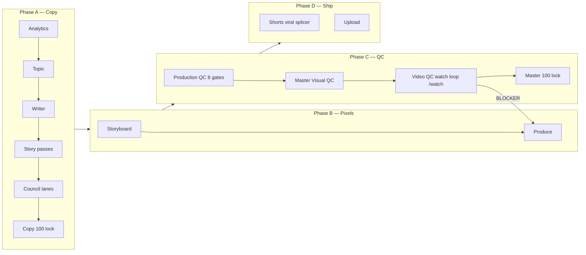

# YouTube production pipeline (portfolio standard)

**Share this doc** with every channel: NTO, Campaign Receipts, SEALED, EstimateProof.

**Share pack (give exactly this directory):** `shared/portfolio-hub/`

| File | Purpose |
|------|---------|
| [`youtube-production-pipeline.md`](youtube-production-pipeline.md) | **This file** — full A→D walkthrough |
| [`council-lanes.md`](council-lanes.md) | How the 6 reviewer lanes split (incl. Lane F watch loop) |
| [`production-qc-8-gates.md`](production-qc-8-gates.md) | The 8 automated QC gates + G9 watch loop |
| [`video-backends-evaluation.md`](video-backends-evaluation.md) | Honest fit eval for Hedra / Sora / Kling / **Seedance 2.0** / Gemini Omni |

Anything channel-specific (NTO, CR, SEALED) lives under `companies/<channel>/content-pipeline/` or `companies/<channel>/eng/` and references these docs — never copy-pastes them.

**Principles borrowed from pro YouTube ops** (MrBeast internal guide + platform best practice):

1. **Packaging and video are one product** — title, thumb, hook, first 30s, and edit pace must match.
2. **Two score locks** — **copy 100/100** before TTS/pixels; **master 100/100** before upload.
3. **Every step has a QC + score** — no persona pass advances without `step_qc.py` PASS (composite ≥ 9/10). Stops "we said we did it" failures.
4. **Specialist lanes, not one “council blob”** — copy, production, animation, packaging, and watch-loop run in parallel where possible.
5. **Automated QC is law** — personas advise; scripts **block upload** on fail.
6. **3rd-grade spoken copy** — shorter words = fewer TTS misreads (Marcion, demiurge, Abba).

**Company implementations:**

| Channel | Runbook | QC runner |
|---------|---------|-----------|
| **Campaign Receipts** | [`companies/campaign-receipts/eng/PRODUCTION-PIPELINE-STEPS.md`](../../companies/campaign-receipts/eng/PRODUCTION-PIPELINE-STEPS.md) | `production-qc.py` ✅ |
| **NTO** | [`companies/NTO/content-pipeline/SCRIPT-PRODUCTION-PIPELINE.md`](../../companies/NTO/content-pipeline/SCRIPT-PRODUCTION-PIPELINE.md) | Port CR gates (in progress) |
| **SEALED** | `eng/longform-scripts/` + movie build | Same storytelling passes + visual QC |
| **EstimateProof** | Standalone repo: [`github.com/ajantoniou/estimateproof`](https://github.com/ajantoniou/estimateproof) — local `/Applications/DrAntoniou Projects/EstimateProof/`. See `eng/PRODUCTION-PIPELINE-STEPS.md` there. | `aspect-ratio-qc.py`, `packaging-qc.py`, `pre-upload-pack.py`, `watch-master.sh`, `production-qc.py`, `step_qc` (+ **guess-game-*** steps) |

---

## Pipeline overview (phases)



---

## Phase A — Copy (before ElevenLabs / fal / Remotion)

**Every step has a QC check + score. Composite ≥ 9/10 to advance; copy lock requires 100/100 at step 3.5.**

| Step | Name | Owner | Output | **QC check + score** | Hard stop |
|------|------|-------|--------|----------------------|-----------|
| **0** | Analytics | analytics / growth | `reports/episodes/*-72hr.md` | Brief cites ≥3 numbers from last 72h (mech grep) | Optional |
| **1** | Topic + packaging angle | Head of Growth + **MrBeast (copy)** | `briefs/<date>-<slug>-slab.md` | Slab has why-now + protagonist + turn-promised | No “we’ll figure out hook later” |
| **2** | First draft | Content writer (**Opus 4.7** dialogue) | `…/<slug>-long.md` | `script-qc.py` PASS (reading level, banned phrases) | Receipt dump / list grammar |
| **2.5** | Domain lock | Theology / fact / legal editor | PASS / REVISE / FAIL | persona output `VERDICT: PASS` | Doctrine or FEC fail |
| **2.7** | Story pass | Screenwriter | Turn, protagonist, scenes | **`step_qc.py --step screenwriter --prev <2> --curr <2.7>` ≥ 9/10** | composite < 9 |
| **2.8** | Clarity pass | JK Rowling storyteller | Picture-first, 3rd-grade gloss | **`step_qc.py --step jk-rowling --prev <2.7> --curr <2.8>` ≥ 9/10** | composite < 9 |
| **2.9** | **MrBeast copy pass** | `mrbeast-viral-producer.md` **mode: COPY** | Hook + re-hooks in script | **`step_qc.py --step mrbeast-copy --prev <2.8> --curr <2.9>` ≥ 9/10** | composite < 9 |
| **3** | **Council lanes** (parallel) | See [council-lanes.md](council-lanes.md) | Lane reports | Synthesizer `VERDICT: SHIP` | Any lane KILL |
| **3p** | Packaging panel | Title + thumb + description personas | `youtube-meta.json`, thumb brief | No HARD VETO + title/thumb story-match score ≥ 9 | HARD VETO |
| **3.5** | Story score **copy** | `storyteller-score-rubric.md` | `story-scores/<slug>.json` | Dims 1–8 all = 10 (composite_copy = 100) | Any dim < 10 |
| **3.6** | Mechanical script QC | `script-qc.py`, storyteller gate | `qc-*.md` PASS | Both PASS, no banned phrases, no VO metadata | Metadata in VO |
| **4** | **Copy lock** | `copy-lock.py` / score lock | `copy-locks/<slug>.json` | exit 0 (copy = 100 + 2.7/2.8/2.9 step-qc all PASS) | **No TTS until PASS** |

### Why 3rd grade helps ElevenLabs

- One idea per sentence; fewer compound clauses → fewer dropped words.
- Spell fragile names once: **M-A-R-C-I-O-N, Mar-see-on**.
- Say **Father** before any borrowed word (no unexplained “Abba”).
- Avoid debate jargon (“paste a verse,” “demiurge”) without a kid-level gloss in the same breath.

---

## Phase B — Storyboard & produce

| Step | Name | Owner | Output | **QC check + score** | Hard stop |
|------|------|-------|--------|----------------------|-----------|
| **5** | Storyboard | Video producer + **Remotion expert** | `storyboard.json` | `validate-storyboard.py` PASS + **`step_qc.py --step storyboard-coverage` ≥ 9** | Beat without `covers_script_section` |
| **5b** | **MrBeast production pass** | `mrbeast-viral-producer.md` **mode: PRODUCTION** | Comments on storyboard | **`step_qc.py --step mrbeast-production` ≥ 9** | No pattern interrupt plan |
| **5c** | Validate storyboard | `validate-storyboard.py` | PASS | exit 0 | Hedra/text policy |
| **6a** | VO | `elevenlabs-tts.py` / `dialogue-vo.py` | `voiceover-review.mp3` | Scribe WER ≤ threshold + hard-word logprob ≥ 0.9 (`--verify-final`) | Scribe WER / hard words |
| **6b** | Founder audio | Founder | Approval note | Founder signoff (manual) | **Blocks video** |
| **7** | Clips | fal / Hedra / Kling / **Seedance R2V** per storyboard | `clips/` | Per-clip render success + budget cap | Budget cap |
| **7r** | **Animation / explainer** | **Remotion** (primary) · fal chart stills (fallback) | `remotion-out/` | All compositions render + on-screen numbers match script | Concept needs diagram but got b-roll only |
| **8** | Edit + grade + music | Video editor + SFX | `master.mp4` | Pacing QC PASS + duration ≈ planned ± 5% | Pacing QC fail |

**MrBeast production pass checks:** pattern interrupts every 60–90s, first frame not stock, b-roll matches spoken noun, end screen teases next ep, no “slow TV” act without a visual turn.

---

## Phase C — QC (automated + spot-watch)

### ✅ PRODUCTION QC PASS (8 gates)

**One command** (Campaign Receipts: `scripts/pipeline/production-qc.py`).  
**Spec:** [production-qc-8-gates.md](production-qc-8-gates.md)

| Gate | What |
|------|------|
| G1 | Script hygiene (no `[pause]` in upload meta, banned phrases) |
| G2 | No `*.verify-FAILED.txt` on VO |
| G3 | Storyboard policy valid |
| G4 | Ship checklist (duration, clip sync, audio stream) |
| G5 | VO scribe banned-phrase / QC spoken |
| G6 | Master scribe banned-phrase |
| G7 | Audio QC (levels, voice match, strict) |
| G8 | Routed to **Master Visual QC** |

**Artifact:** `<build>/production-qc.json` with `"pass": true` — **required for upload**.

### ✅ MASTER VISUAL QC PASS

**Command:** `master-visual-qc.py`  
**Checks:** OCR on-screen text vs storyboard, wrong-episode overlays, text-card jitter, safe zones, “RECEIPT”/chart legibility.

**Artifact:** `<build>/master-visual-qc.json`

### Council on master (post-render, parallel lanes)

| Lane | When | Focus | **Score** |
|------|------|-------|-----------|
| **Production** | After master | Edit pace, dead air, hook on timeline | SHIP/REVISE/KILL |
| **Animation** | If Remotion clips | Chart truth, readability 9:16 | SHIP/REVISE/KILL |
| **Audio** | Always | Scribe sync, mumble, music duck | SHIP/REVISE/KILL |
| **Packaging** | Before upload | Title/thumb vs first 30s | SHIP/REVISE/KILL |
| **Video QC (watch loop)** | After master | `/watch` skill feeds frames + transcript to `20-video-qc-watcher`; emits WINS / LOSSES / RETRY PLAN | **0 BLOCKERs** + `step_qc.py --step video-qc-summary ≥ 9` |

**Watch loop command (NTO):**

```bash
python3 companies/NTO/scripts/council-review.py \
  --script content/scripts/<slug>-long.md \
  --slug <slug>-video-qc \
  --video content/videos/<folder>/master.mp4
```

Exit code `2` on any `BLOCKER` → producer reruns the named beats/VO chunks → re-watch → repeat until clean. Wins/losses get rolled into the same `reports/council/<slug>-*.md` file the rest of the council writes to.

Then **master story score 100/100** (dims 9–10: `cinematic_pacing`, `visual_story_match`).

---

## Phase D — Shorts (not a dumb crop)

| Step | Name | Tool | Output |
|------|------|------|--------|
| **6s.1** | Transcribe master | Scribe word JSON | `audio-qa/*.transcript.json` |
| **6s.2** | **Viral moment mining** | `viral-splicer.py` (spec below) + MrBeast + clip-cutter | `viral-segments.json` |
| **6s.3** | **Smart splice** | Rank by hook question + retention + Remotion need | `shorts-plan.json` |
| **6s.4** | **Remotion explainer beats** | `/remotion/` compositions 1080×1920 | `shorts/remotion/*.mp4` |
| **6s.5** | Assemble Short | `produce-short-generic.mjs` (CR) or `render-text-short.py` / `cut-shorts-v2.py` + Remotion concat (NTO) | `shorts-v2/short-NN.mp4` |
| **6s.6** | Shorts Production QC | Same 8 gates, `--mode short` | `production-qc.json` |

### Viral splicer (design — all channels)

**Goal:** Find 8–15 windows that can stand alone on Shorts feed, not even chops.

**Inputs:** word-level transcript, `shorts-cuts-v2.json` or council clip-cutter notes, MrBeast retention marks.

**Scoring each candidate window (0–10):**

- Hook question in first 3s (text card + VO)
- One clear “turn” before 15s
- Visual: prefers beat that needs **Remotion** (timeline, split scroll, map) over talking head only
- No mid-sentence start; no theology inside joke without setup
- **Standalone test:** “Would a stranger share this?”

**Outputs:**

```json
{
  "segments": [
    {
      "id": "short-03",
      "start_s": 142.2,
      "end_s": 172.8,
      "hook_question": "Why did the church bury Marcion?",
      "remotion_composition": "CanonTimeline",
      "mrbeast_score": 9.2,
      "reason": "turn at 148s + diagram beat"
    }
  ]
}
```

**NTO path:** extend `cut-shorts-v2.py` → call `viral-splicer.py` first; render Remotion cards per segment; then ffmpeg assemble. For text-card/music Shorts, prefer `companies/NTO/scripts/render-text-short.py`; its vertical subscribe outro card is the current Shorts standard and should replace the long-form Remotion subscribe card in Shorts.  
**CR path:** already uses `viral-segments.json` in `produce-short-generic.mjs` — align schema.

**Explainer tools (priority):**

1. **Remotion** (portfolio `/remotion/`) — charts, timelines, verdict stamps  
2. **fal FLUX still + ken-burns** — atmosphere only  
3. **Avoid:** text-heavy generative video (illegible numbers)

**Generative video backends (priority — May 2026):**

1. **Hedra Character-3** — talking-head VO on-camera (James, Betsy). `HEDRA_API_KEY` ✅
2. **fal Sora 2 / Kling 3 Pro** — atmospheric / cinematic b-roll, no character. `FAL_KEY` ✅
3. **Seedance 2.0 R2V (fast)** via fal — **named character in a scene with multi-image reference** + **v2v patcher for 9w visual BLOCKERs** ($0.145/s w/ video input). `FAL_KEY` ✅ — **GA today**.
4. **Gemini Omni Flash** — **WATCH LIST** (dev API not GA). Mixed-input b-roll + conversational v2v edit when shipped.

Full decision matrix: [`video-backends-evaluation.md`](video-backends-evaluation.md).

---

## Phase E — Upload

| Step | Tool | **QC check** | Hard stop |
|------|------|--------------|-----------|
| **10** | `pre-upload-pack.py` | Thumb + description + chapters present | Missing thumb / description |
| **11** | `youtube-upload.py` | `production-qc.json` `pass: true` AND master score = 100 AND G9 exit 0 AND all step_qc PASS | Any of the above missing |

---

## Per-step QC matrix (binding, every step)

**One shared scorer:** `shared/scripts/step_qc.py` — `--step <id> --prev <artifact> --curr <artifact>`. Exit 2 below 9/10.

| Phase | Step | QC tool | Pass condition | Artifact written |
|-------|------|---------|----------------|------------------|
| A | 2 First draft | `script-qc.py` | mech PASS | `qc-script-*.md` |
| A | 2.5 Domain | persona | `VERDICT: PASS` | review.md |
| A | **2.7 Screenwriter** | `step_qc.py --step screenwriter` | composite ≥ 9 | `<curr>.step-qc.screenwriter.json` |
| A | **2.8 JK Rowling** | `step_qc.py --step jk-rowling` | composite ≥ 9 | `<curr>.step-qc.jk-rowling.json` |
| A | **2.9 MrBeast COPY** | `step_qc.py --step mrbeast-copy` | composite ≥ 9 | `<curr>.step-qc.mrbeast-copy.json` |
| A | **2.9b Guess game COPY** (EP Shorts) | `step_qc.py --step guess-game-copy` | composite ≥ 9 | `<curr>.step-qc.guess-game-copy.json` |
| A | 3 Council lanes | `council-review.py` | synth `VERDICT: SHIP` | `reports/council/*.md` |
| A | 3.5 Story score copy | `story-score-lock.py --phase copy` | 100/100 | `story-scores/<slug>.json` |
| A | 4 Copy lock | `copy-lock.py` | exit 0 | `copy-locks/<slug>.json` |
| B | 5 Storyboard | `validate-storyboard.py` + `step_qc.py --step storyboard-coverage` | both PASS | `qc-*.md` + JSON |
| B | **5b MrBeast PRODUCTION** | `step_qc.py --step mrbeast-production` | composite ≥ 9 | JSON |
| B | **5b Guess game PRODUCTION** (EP Shorts) | `step_qc.py --step guess-game-production` | composite ≥ 9 | JSON |
| B | 6a VO | `dialogue-vo.py --verify-final` | scribe WER PASS + hard-word logprob ≥ 0.9 | `*.verify-*.txt` |
| B | 7r Animation | Remotion render | exit 0 + on-screen numbers match | `remotion-out/` |
| C | 9 Production QC | `production-qc.py` | G1–G8 all `pass: true` | `production-qc.json` |
| C | 9v Master visual | `master-visual-qc.py` + **`pillarbox_qc.py`** | OCR ≥ 95% match + **canvas ≥ 90% content** (pillarbox/letterbox <10%) | `master-visual-qc.json` + `pillarbox.json` |
| C | **9w Video QC watch loop** | `council-review.py --video master.mp4` + `step_qc.py --step video-qc-summary` | 0 BLOCKERs + composite ≥ 9 | `reports/council/*-video-qc-*.md` + JSON |
| C | 9.5 Master story score | `story-score-lock.py --phase master` | dims 9–10 = 10 | `story-scores/<slug>.json` |
| E | 11 Upload | `youtube-upload.py` | refuses if any above missing/failing | YouTube videoId |

**Adding a step?** Append a `STEP_RUBRIC` entry to `shared/scripts/step_qc.py`. **Do not** create a sibling script.

---

## MrBeast — two passes (mandatory)

| Pass | Step | Reviews |
|------|------|---------|
| **COPY** | 2.9 + packaging | Script hook, re-hooks, title/thumb match, 3rd-grade pace |
| **PRODUCTION** | 5b + 6s.2 + lane C | Storyboard interrupts, clip choices, Shorts splice points, AVD shape |

Same persona file: [`shared/personas/mrbeast-viral-producer.md`](../personas/mrbeast-viral-producer.md) — use `MODE: COPY` or `MODE: PRODUCTION` in the review header.

---

## Quick command cheat sheet

```bash
# === Copy phase — per-step QC (run in order, halt on exit 2) ===
python3 shared/scripts/step_qc.py --step screenwriter        --prev <draft.md>      --curr <screenwriter.md>      --slug <slug>
python3 shared/scripts/step_qc.py --step jk-rowling          --prev <screenwriter.md> --curr <jk.md>              --slug <slug>
python3 shared/scripts/step_qc.py --step mrbeast-copy        --prev <jk.md>         --curr <mrbeast-copy.md>      --slug <slug>

# Council + copy lock (CR shown — NTO has equivalents under companies/NTO/scripts/)
python3 companies/campaign-receipts/scripts/pipeline/council-review.py --script <script.md> --slug <slug>
python3 companies/campaign-receipts/scripts/pipeline/story-score-lock.py --slug <slug> --phase copy
python3 companies/campaign-receipts/scripts/pipeline/copy-lock.py --slug <slug>

# === Produce phase ===
python3 shared/scripts/step_qc.py --step storyboard-coverage --prev <script.md>     --curr <storyboard.json>      --slug <slug>
python3 shared/scripts/step_qc.py --step mrbeast-production  --prev <storyboard.json> --curr <storyboard.md-note> --slug <slug>
python3 companies/campaign-receipts/scripts/pipeline/produce-from-storyboard.py --storyboard <storyboard.json>

# === Master QC ===
python3 companies/campaign-receipts/scripts/pipeline/production-qc.py --storyboard <storyboard.json> --piece <slug>
# → ✅ PRODUCTION QC PASS (8 gates)
# → ✅ MASTER VISUAL QC PASS

# Video QC watch loop (G9) — exit 2 BLOCKER → fix → repeat
python3 companies/NTO/scripts/council-review.py --script <script.md> --slug <slug>-video-qc --video <master.mp4>
python3 shared/scripts/step_qc.py --step video-qc-summary --prev <storyboard.json> --curr reports/council/<slug>-video-qc-*.md --slug <slug>

python3 companies/campaign-receipts/scripts/pipeline/story-score-lock.py --slug <slug> --phase master
python3 companies/campaign-receipts/scripts/pipeline/youtube-upload.py --storyboard <storyboard.json>
```

---

## NTO Ep2 (current)

1. Lock **script v6** (3rd grade) + copy score 100  
2. Re-run `dialogue-vo.py`  
3. Founder audio approve  
4. Storyboard + MrBeast production pass  
5. Port or run adapted `production-qc.py`  
6. Shorts: `viral-splicer` → Remotion → assemble  

*Last updated: 2026-05-22*
